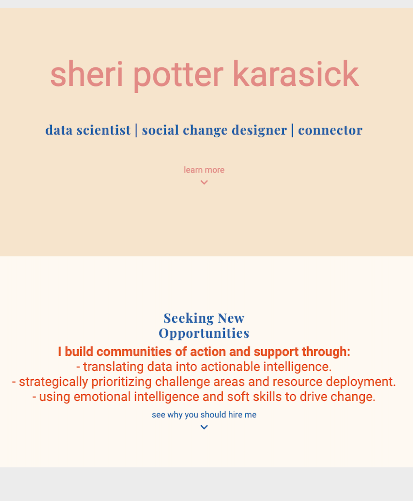
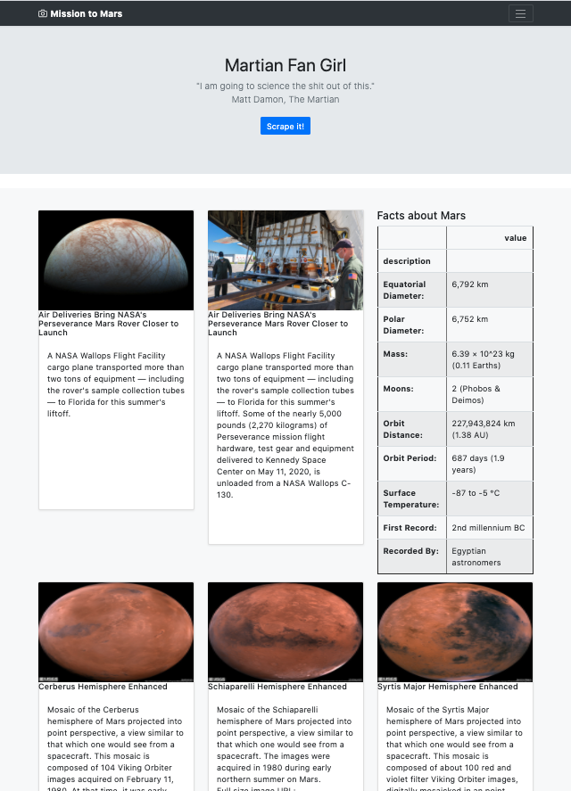

# Mission-to-Mars

##Summary
This project integrates an online database (Mongo DB) with a BootStrap web template to design a simple website featuring Mars.  The website is written in html and published using Flask.  Data is scraped from other websites using Splinter and Beautiful Soup.  The code for scraping was written in Jupyter Notebook.

The project also included a brief attempt to develop a personal, professional portfolio using an html template with CSS styling.

## Portfolio Images
 

